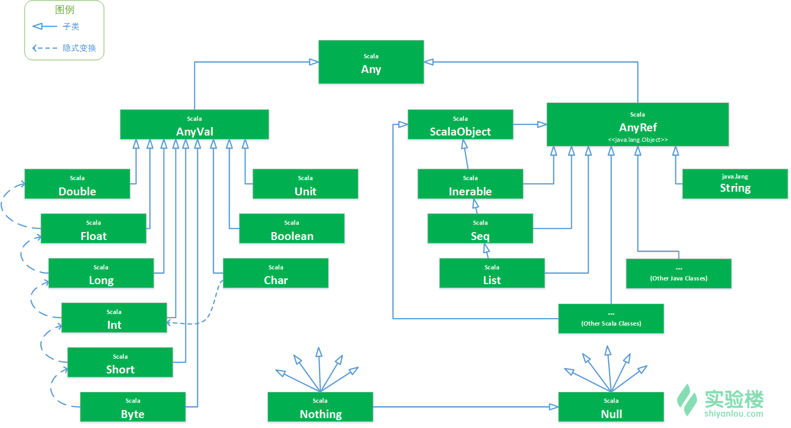

# ScalaLearning Scala学习记录

> A repo about how to learn scala

This repo has two modules, first is an introduction to different part of scala, second is a project about how to use scala to manage sql.

## Getting Started 使用指南

Use IDEA to open project, import all the package with maven, and you can run it. 

### Prerequisites 项目使用条件

Need IDEA and JAVA 1.8 SDK.

### Installation 安装

Import this project into IDEA and run the application

## Deployment 部署方法

Has no deployment.

## Contributing 贡献指南

Please read [CONTRIBUTING.md](#) for details on our code of conduct, and the process for submitting pull requests to us.

清阅读 [CONTRIBUTING.md](#) 了解如何向这个项目贡献代码

## Release History 版本历史
* 0.1.0
    * give the finished version

## Authors 关于作者

* **Humphrey** - *Initial work* - [Humphrey]( www.humphreyhao.com:8080)

查看更多关于这个项目的贡献者，请阅读 [contributors](#) 

## License 授权协议

这个项目 MIT 协议， 请点击 [license.md](license.md) 了解更多细节。